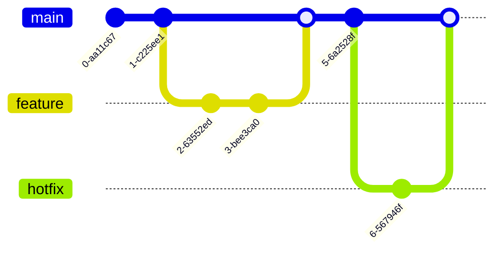

# Mermaid 图表

使用 Mermaid 语法创建文档和可视化图表。Mermaid 是一种基于文本的图表绘制工具，可以在 Markdown 中直接嵌入图表定义。

## 快速参考

Mermaid 图表使用 `mermaid` 语言标识符的 Markdown 代码块编写。

## 流程图


### 流程图语法
```
flowchart TD          %% TD = top-down, LR = left-right, RL, BT
    A[矩形]      %% Square brackets = rectangle
    B(圆角矩形)        %% Parentheses = rounded rectangle
    C{菱形}        %% Curly braces = diamond/decision
    D[[子程序]]   %% Double brackets = subroutine
    E[(数据库)]     %% Cylinder shape
    F((圆形))       %% Double parentheses = circle
    G>不对称]     %% Flag shape

    A --> B           %% Arrow
    B --- C           %% Line without arrow
    C -.-> D          %% Dotted arrow
    D ==> E           %% Thick arrow
    E --text--> F     %% Arrow with label
    F -->|label| G    %% Alternative label syntax
```

### 子图


## 序列图


### 序列图语法
```
sequenceDiagram
    participant A as 张三
    participant B as 李四

    A->>B: 实线带箭头
    A-->>B: 虚线带箭头
    A-)B: 实线开放箭头
    A--)B: 虚线开放箭头
    
    activate B          %% 激活框
    B->>A: 响应
    deactivate B
    
    Note over A,B: 这是一个备注
    Note right of A: 右侧备注
    
    alt 条件为真
        A->>B: 执行这个
    else 条件为假
        A->>B: 执行那个
    end
    
    loop 每分钟
        A->>B: 心跳检测
    end
    
    opt 可选操作
        A->>B: 可能执行这个
    end
```

## 类图


### 类图语法
```
classDiagram
    class 类名 {
        +公有字段
        -私有字段
        #受保护字段
        ~包级字段
        +公有方法()
        -私有方法()
    }
    
    ClassA <|-- ClassB : 继承
    ClassC *-- ClassD : 组合
    ClassE o-- ClassF : 聚合
    ClassG --> ClassH : 关联
    ClassI ..> ClassJ : 依赖
    ClassK ..|> ClassL : 实现
```

## 实体关系图


### ER 图基数符号
```
||--||   一对一
||--o{   一对零或多
||--|{   一对一或多
}o--o{   零或多对零或多
```

## 甘特图


## 状态图


## 饼图


## Git 图



## 用户旅程图


## 思维导图


## 样式定义


## React 组件

```tsx
import mermaid from 'mermaid';
import { useEffect, useRef } from 'react';

// --------------------------------------------------------------------------------
// Mermaid 初始化配置
// --------------------------------------------------------------------------------
mermaid.initialize({
  startOnLoad: true,
  theme: 'neutral', // default, dark, forest, neutral
  securityLevel: 'loose',
});

interface MermaidProps {
  chart: string;
  id?: string;
}

// --------------------------------------------------------------------------------
// Mermaid 组件：渲染 Mermaid 图表
// --------------------------------------------------------------------------------
export function Mermaid({ chart, id = 'mermaid-diagram' }: MermaidProps) {
  const ref = useRef<HTMLDivElement>(null);

  useEffect(() => {
    if (ref.current) {
      mermaid.render(id, chart).then(({ svg }) => {
        if (ref.current) {
          ref.current.innerHTML = svg;
        }
      });
    }
  }, [chart, id]);

  return <div ref={ref} className="mermaid-container" />;
}

// 使用示例
<Mermaid
  chart={`
    flowchart LR
      A --> B --> C
  `}
/>
```

## 使用技巧

1. **方向**: 使用 `TD`（从上到下）、`LR`（从左到右）、`BT`（从下到上）、`RL`（从右到左）
2. **注释**: 使用 `%%` 添加注释
3. **引号**: 对包含特殊字符的标签使用引号：`A["带括号的标签(parentheses)"]`
4. **换行**: 使用 `<br/>` 实现多行标签

## 相关资源

- **Mermaid 官方文档**: https://mermaid.js.org/
- **在线编辑器**: https://mermaid.live
- **GitHub 支持**: Mermaid 原生支持 GitHub Markdown
